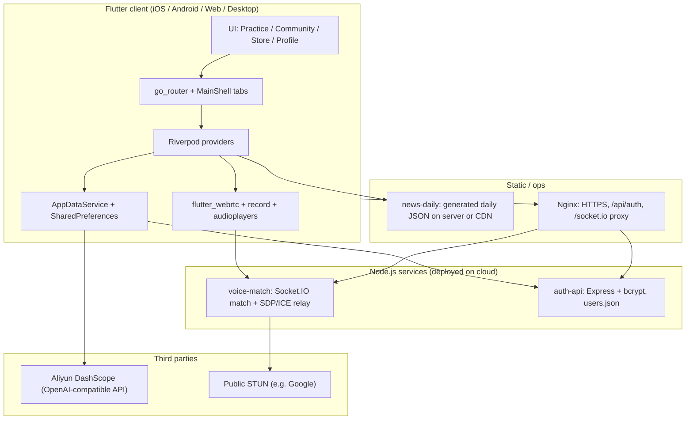

# Eunoia — Technical Documentation (ENT208TC)

**Section 1 — System Architecture**

_2–3 pages — component diagram, data flow, technology stack overview_

The Eunoia system is a cross-platform IELTS learning application with gamification (E points, gacha, 3D collectibles) and optional cloud services for authentication, real-time voice matchmaking, and LLM-based grading. The following diagram is a **logical** view; names match the subsections below.

**Component overview**

- **Flutter client (Eunoia app):** Presents the product UI (practice modules, community feed, store/gacha with GLB previews, profile/leaderboard). It uses `go_router` for deep links and a tabbed shell. `AppDataService` centralizes user progress, E points, wrong-note archives, and local auth state. It is the only component the end user installs; it can run in a “fully local” mode for demos.

- **AppDataService + SharedPreferences:** Persists accounts, scores, check-ins, and inventory on device. This keeps the app usable offline for core study flows and avoids a mandatory backend for class demos. When a remote auth API is deployed, the server README describes how it can override local snapshots for the same account.

- **Voice match service (`server/voice-match`):** A small Node.js process using Socket.IO to queue two anonymous users, exchange WebRTC offer/answer/ICE candidates, and time out after about 60 seconds. **Audio media is peer-to-peer**; the server does not transcode audio. It is required for the “anonymous voice match” practice feature at scale.

- **Auth API (`server/auth-api`):** Optional Express service storing **bcrypt** password hashes in `data/users.json`. Intended for Flutter Web same-origin calls via Nginx (`/api/auth/... → localhost:3848`). Supports register/login for 6–12 character alphanumeric accounts as described in the project README.

- **News / daily paper JSON (`server/news-daily`):** Operational script that calls DashScope to generate a dated `news_mock_daily_YYYY-MM-DD.json` for the “daily global news” reading mock. The app fetches this as static JSON over HTTPS when `NEWS_MOCK_DAILY_BASE_URL` (or URL pattern) is set.

- **DashScope (LLM API):** Used for IELTS-style writing/speaking feedback and content generation. The client may call the API **directly** with a compile-time `DASHSCOPE_API_KEY` (convenient for coursework); production should proxy through a backend to protect keys.

- **Nginx (production):** Terminates TLS for `www.eunoia5.top`, serves Flutter Web build, reverse-proxies `/socket.io` to the voice service and `/api/auth` to the auth API, avoiding **mixed content** (HTTPS page → HTTP socket) on Web.

**Data flow**

**Main use case — daily practice with AI feedback:** The user opens the Practice tab, navigates to a module (e.g. writing or “news brief mock”). For writing, the user’s answer text is sent to DashScope (via `NewsMockAIService` and related methods) as an HTTP request; the model returns band scores and comments, which are shown in the UI and can be tied to local progress in `AppDataService`. For “daily” news content, the app first requests a static JSON file from the configured base URL (date in Asia/Shanghai), then renders questions; grading again may call DashScope. **Origin of data:** user input + static JSON; **processing:** client and remote LLM; **storage:** results and rewards in SharedPreferences.

**Secondary use case — anonymous voice practice:** Two users open the same feature and tap connect. Each Flutter client opens a WebRTC peer connection, connects Socket.IO to `VoiceMatchConfig.resolveSignalUrl()` (same origin on Web when proxied, or `VOICE_SIGNAL_URL` / default localhost:3847 on mobile). The server pairs them and relays signaling; **RTP audio flows peer-to-peer** after ICE succeeds (STUN by default). If NAT is symmetric and STUN fails, users would need TURN (not bundled in the reference project).

---

**Section 2 — Technology Justification**

_2–3 pages — why you chose each technology, alternatives considered, trade-offs_

| **Technology / Tool** | **What we chose** | **Alternatives considered** | **Why we chose this** |
| --- | --- | --- | --- |
| Client framework | Flutter 3.x + Dart ^3.11 | React Native; native Swift/Kotlin per platform | Single codebase for mobile + web + desktop; strong UI rebuild performance; team alignment with Dart null-safety and Material/Cupertino widgets; matches course emphasis on deliverable prototypes across platforms. |
| App architecture | Riverpod + `go_router` | Bloc/Cubit + Navigator 2; GetX | Riverpod gives testable DI and scoped rebuilds; `go_router` matches URL-driven navigation for Web and deep links for practice sub-routes (e.g. `/practice/word-tower`). |
| Local persistence | `shared_preferences` | Isar/hive/SQLite | Minimal schema (JSON blob of user list and progress); fast to ship; adequate for coursework and demos. Trade-off: not ideal for complex relational queries or multi-device sync. |
| Real-time voice | `flutter_webrtc` + Socket.IO server | LiveKit/Agora SDK; WebRTC only without signaling service | Socket.IO signaling is small and self-hosted on the existing VPS; avoids vendor lock-in and per-minute fees for a student project. Trade-off: no built-in TURN; operational burden on us. |
| LLM | Alibaba DashScope (OpenAI-compatible HTTP) | OpenAI API; Azure OpenAI; local Llama | DashScope fits deployment in CN regions and assignment tooling; HTTP compatibility keeps client code simple. Trade-off: **embedding API keys in the client is insecure** for production. |
| 3D previews | `model_viewer_plus` (local path dependency) | SceneKit only on iOS; Unity embed | Web-first GLB viewing aligned with store/gacha previews; Flutter federated implementation reduces platform-specific glue. |
| Backend auth | Node + Express + bcrypt + JSON file | Supabase Auth; Firebase Auth; PostgreSQL | Zero cold-start DB setup for teaching demos; easy Nginx same-origin proxy; explicit limitation: not horizontally scalable without redesign. |

**Technical risks and mitigation**

- **API key exposure:** DashScope keys injected via `--dart-define` can be extracted from builds. **Mitigation:** document backend proxy as the production approach; rotate keys if leaked; restrict keys in the cloud console.

- **WebRTC connectivity:** STUN-only may fail on restrictive NATs. **Mitigation:** document coturn/TURN and ICE server configuration in code for advanced deployment.

- **Split brain between local app state and optional server auth:** Progress remains mostly local per README. **Mitigation:** future sync API; clear user messaging that reinstall may lose data without backup.

---

**Section 3 — Deployment Guide**

_1–2 pages — step-by-step setup, environment requirements, troubleshooting_

**Environment requirements**

| **Requirement** | **Version / Notes** |
| --- | --- |
| Flutter SDK | Compatible with Dart SDK ^3.11.4 (see `pubspec.yaml` / `.metadata`) |
| Node.js | >= 18 (voice-match `package.json` engines) |
| npm | Bundled with Node |
| OS | Windows / macOS / Linux for development; Ubuntu on VPS for production examples |
| Optional | Nginx, systemd, TLS certificate (Let’s Encrypt) for Web + WSS |
| Optional | Aliyun DashScope API key; Tencent cloud instance (README cites HK region example) |

**Setup steps**

1. **Obtain the source tree:** Clone or unzip the Eunoia project to your machine. _(If using Git, replace with your course or team repository URL; this workspace may be distributed as a zip.)_

2. **Install Flutter dependencies:** From the project root:  
   `flutter pub get`

3. **Configure environment variables (compile-time):** Pass when running or building, as needed:  
   - `DASHSCOPE_API_KEY` — LLM grading and generation.  
   - `NEWS_MOCK_DAILY_BASE_URL` or `NEWS_MOCK_DAILY_URL_PATTERN` — daily JSON location.  
   - `VOICE_SIGNAL_URL` — Socket.IO base URL (mobile/desktop); Web often uses same origin behind Nginx.  
   - For deployed Web auth per `server/auth-api/README.md`: `AUTH_API_BASE_URL` as documented there.  
   Example:  
   `flutter run --dart-define=DASHSCOPE_API_KEY=sk-xxxx`

4. **Run the Flutter application:**  
   `flutter run`  
   Select a device or Chrome for Web.

5. **Verify it is working:** App launches to the Practice tab; navigation between Practice / Community / Store / Profile works; optional: open anonymous voice match with local `server/voice-match` running and hit `http://127.0.0.1:3847/health` → `ok`.

**Optional: Node services**

- Auth API: `cd server/auth-api && npm install && npm start` (default port 3848, health: `/health`).  
- Voice match: `cd server/voice-match && npm install && node index.js` (default 3847; see `DEPLOY.md` for systemd and firewall).  
- Daily news JSON: `cd server/news-daily && export DASHSCOPE_API_KEY=... && node generate.mjs` per that folder’s README.

**Common issues and solutions**

| **Problem** | **Likely cause** | **Solution** |
| --- | --- | --- |
| Web voice match fails with websocket / mixed content errors | HTTPS page trying `http://IP:3847` | Proxy `/socket.io/` through Nginx on the same origin as the Flutter Web app; or set `VOICE_SIGNAL_URL` to `https` endpoint (see `server/voice-match/DEPLOY.md`). |
| LLM features return empty or errors | Missing or invalid `DASHSCOPE_API_KEY` | Rebuild with `--dart-define=DASHSCOPE_API_KEY=...`; verify model access in Aliyun console. |
| `flutter pub get` SDK mismatch | Local Flutter too old for Dart ^3.11 | Upgrade Flutter channel per `flutter doctor` guidance. |

---

**Section 4 — IP Strategy**

_1 page — novelty, prior art, patent decision, alternative protection_

**Novelty analysis**

Eunoia combines **IELTS-specific study flows** (listening/reading/writing/speaking practice, wrong-note archives, band-style feedback) with **gamification** (E currency, gacha/“supply pod,” 3D figure/E-pet GLB assets) and **social/community UI**, plus an **anonymous WebRTC voice lobby** for paired speaking practice. The **exact bundle** of UI/flows and the integration pattern (local-first progress + optional lightweight Node services + DashScope) is project-specific; individual building blocks (Flutter, WebRTC, LLM APIs) are not novel alone.

**Prior art (2–3 examples)**

| **Existing product / patent** | **What it does** | **How your solution differs** |
| --- | --- | --- |
| Duolingo | Gamified language learning, streaks, hearts | Eunoia targets **IELTS band scoring and paper formats**, not general vocabulary trees; includes **voice match** and **China-deployable LLM** option. |
| IELTS AI / prep apps (e.g. major publishers’ apps) | Practice tests, some AI scoring | Eunoia’s **open, documented stack** (Flutter + self-hosted signaling + file-backed auth) and **custom economy/gacha** differ from closed commercial apps. |
| Voice chat / Clubhouse-class apps | Real-time voice rooms | Eunoia focuses on **matched pairs for exam practice** with **short timeout matchmaking** and **education-centric UX**, not social broadcasting. |

**Patent decision**

**No.** Software patents are costly, slow, and often weak for incremental mobile-app features unless there is a clearly non-obvious technical effect; our novelty is mainly **product integration and UX** rather than a single enforceable technical claim. For a student/course project, **trade secret + copyright** on code and assets is more proportionate than patent filing.

**Alternative protection**

- **Copyright** on source code, UI assets, and GLB models; license terms for team/course submission.  
- **Trade secrecy** for deployment parameters (API routing, prompts tuning, gacha probabilities) and server-side keys kept off the client in production.

---

**Section 5 — Limitations & Future Work**

_1 page — known issues, scalability constraints, planned next steps_

**Known limitations**

| **Limitation** | **Why it exists** | **Impact on users** |
| --- | --- | --- |
| Progress mostly device-local | `SharedPreferences` design for speed and offline use | Reinstalling the app or switching devices may **not** restore progress unless export/sync is added. |
| DashScope key in client (dev pattern) | Course convenience | Risk of key abuse if APK/IPA is extracted; not acceptable for public production. |
| No bundled TURN server | Cost/complexity | Some users on strict NATs may **fail voice pairing** even when signaling works. |
| Auth API JSON file store | Simplicity for demos | Not suitable for high concurrency or HA without DB migration. |

**Future work**

- **Feature or improvement planned —** Server-side LLM proxy and user sync API for multi-device profiles and secure keys.

- **Technical debt to address —** Replace client-side key injection with environment-specific backend; add automated tests for `go_router` flows and WebRTC happy-path integration tests where feasible.

- **Open research question —** How to calibrate LLM band scores to official IELTS rubrics reliably across prompts and reduce variance between model versions.

---

**References**

_APA 7th edition. References are not counted in the page limit._

Flutter Team. (n.d.). *Flutter documentation*. https://docs.flutter.dev/

Google LLC. (2024). *WebRTC*. https://webrtc.org/

Alibaba Cloud. (n.d.). *DashScope API reference*. https://help.aliyun.com/zh/model-studio/

Fielding, R., & Resnick, J. (Eds.). (2022). *Hypertext Transfer Protocol (HTTP/1.1): Semantics and content* (RFC 9110). IETF. https://www.rfc-editor.org/rfc/rfc9110

Oracle Corporation. (n.d.). *Node.js — About*. https://nodejs.org/en/about/
